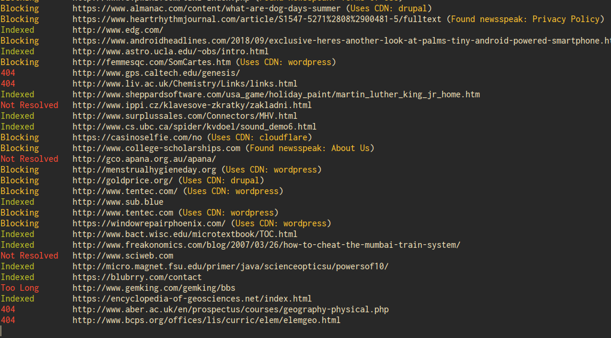

# Crawler

_A simple (and highly opinionated) web-crawler/search-engine written in Python_




## Installation and Usage

### Setting up MySQL

- [Install MySQL](https://dev.mysql.com/doc/mysql-installation-excerpt/5.7/en/) for your distribution/OS
- Make sure it is installed: `mysql --version`
- Enable/start the MySQL Server. Usually `systemctl start mariadb` or `systemctl start mysql`
- Log in to MySQL as root: `sudo mysql -u root -p`. Press enter when prompted for password
- Make a new user, create a database, and give the new user rights to the database. **Important:** Use the _exact_ same credentials. Copy-paste.
```mysql
CREATE USER 'pycrawl'@'localhost' IDENTIFIED BY 'PaSSwoRd';
CREATE DATABASE search_index;
GRANT ALL PRIVILEGES ON search_index.* TO 'pycrawl'@'localhost';
FLUSH PRIVILEGES;
quit
```
- Now login as the new user: `mysql -u pycrawl -p`. Type in `PaSSwoRd` when prompted for password.
- Create a table in the new database to add indexed results:
```mysql
USE search_index;
CREATE TABLE search_index (url VARCHAR(255), title VARCHAR(255), content LONGTEXT);
```

### Using the Crawler


Clone and `cd`:
```bash
git clone "https://github.com/nerdynewt/crawler" && cd crawler/pycrawl
```

Put the urls you need to crawl in `todo.txt`. ex:
```bash
echo "https://www.splitbrain.org" >> todo.txt
```

Run the crawler script:

```bash
python newmain.py
```

### Using the web frontend

- Install `php`
- [Set up](https://wiki.archlinux.org/index.php/PHP#MySQL/MariaDB) `php` to be used with MySQL
- From the project root folder, start a development `php` server: `php -S 0.0.0.0:8000`

Now, if your query is _Richard Stallman_, navigate to:

<http://localhost:8000/query.php?q=richard%20stallman>

Yeah, I'm lazy.


## Philosophy

Google searches aren't too helpful if you're looking for a random person's opinions or random rants on personal blogs. Most of the time, all you get is the opinion of a 'journalist' (whose _very_ job is to have opinions) or a spammy WordPress "blog" site full of affiliate links. This crawler/search-engine aims to completely ignore the kind of websites you get on google search results and tries to index genuine personal web logs.

## Features

As I said, this is a highly opinionated script, and makes broad sweeping generalizations and assumptions on the present state of the internet and the needs of the user. So these aren't bugs, these are features:

### Blocklists

- *Completely ignores links to popular sites*: Big-business sites like Google, Facebook, YouTube, Twitter, etc are explicity ignored through a blocklist. Such links won't even be traversed.
- *Ignores News Sites*: Similarly, the blocklist also contains mainstream news sites like theguardian, nytimes, huffpost, etc.
- *Ignores _some_ listicle sites*: Same as above, think techcrunch, buzzfeed, etc

Of course, these can be bypassed by editing the blocklist as will be described, but that's not the intent. Traversing these sites would increase the crawl-list significantly without adding much original content. Also, this would be a fool's errand, as these sites are already indexed and served first-page by Google. If, however you _really_ want results from these sites, please use [this](https://google.com) search engine instead.

### More Important Features

- *Detects WordPress sites*: Simple WYSIWYG website generators like WordPress, Drupal, ASP.NET and Squarespace reduce the barrier for entry and therefore tends to produce bottom-of-the-barrel low-effort content mainly geared towards gaining the search system (muh SEO) and exploiting it for making money through ads and affiliate marketing. The CMS will be detected from the HTML header and if the site runs on such technologies, the domain will be put on a blacklist and ignored from then on.
- *Detects Corporate Landing Pages*: A good chunk of your crawl results will be the landing page to some random HR firm or a bank. Thankfully, such sites are practically carbon copies of each other. The crawler looks for common corporate buzzwords like "Privacy Policy", "Code of Conduct" or "Diversity" in the footer and adds these sites to a blocklist to be ignored.
- *No Traverse Loops*: The crawler visits the same domain only 15 times in total. So no loops.
- *JSON and HTML output*: You can find the results of the crawl as a `results.html` file or as a `search.json` file. I should probably use a database for this, but whatever.
- *Simple Javascript frontent*: There's a simple javascript frontend that reads `search.json` and performs the search client-side. This is bad practice, and I will probably set up a MySQL-PHP stack later. The search script and css are stolen from ronv's [Sidey](https://github.com/ronv/sidey) theme for Jekyll.

## Configuration

As of now, the script uses three files:

- `excludes.txt`: This is a list of regular expressions. Any link matching these will be ignored. By default, this file contains some popular sites, non-html links and ad/tracking/cdn subdomains. You can add sites you don't like here.
- `sinners.txt`: You don't have to edit this. This file is populated whenever the crawler encounters a website running on CMS-driven sites
- `corporates.txt`: A list of detected corporate landing pages. Again, you don't have to edit this, this is read from and written to automatically.

## Similar Projects

Although this is a Sunday-evening hackjob, there are a couple other projects that work similarly and are more fleshed out:

- [wiby](https://wiby.me): This is a simple website for the 'old web'. Only select websites chosen by the author are indexed, and they should agree to strict design guidelines (no flashy css, no javascript).
- [YaCy](https://yacy.net): This is a promising project and seeks to set up a decentralized network of crawlers and index-servers, which can be queried on search-time. However, in spite of the size of the network, the results are a bit lacking. Also, the project seems badly bloated, and is written in java with apparently only a confusing web-interface.

## Todo

- [X] An actual database for indexed results, and LAMP framework
- [X] KeyboardInterrupt Doesn't work? Have to `killall python`, lol
- [ ] Command-line arguments, more configuration options
- [ ] API for remote querying of indexed results
- [ ] A good web frontend with nice HTML and CSS
